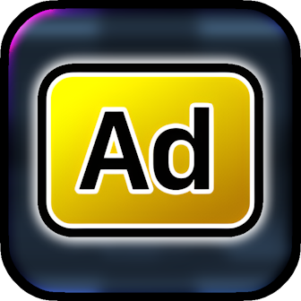
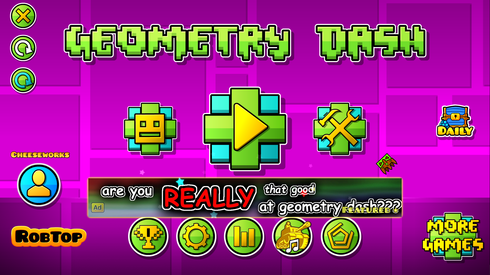
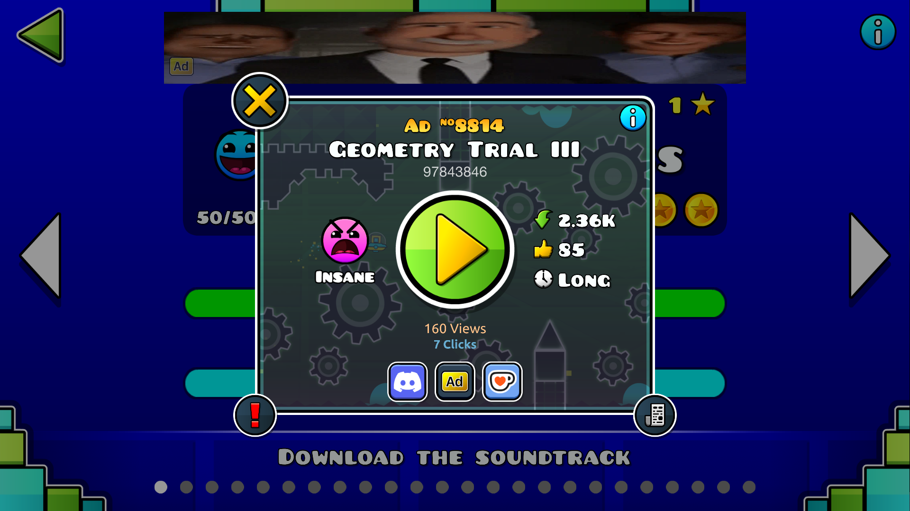

#  Player Advertisements
Community-led exposure platform for levels!

>   

>  
>  
> 

> [!TIP]
> *This mod has settings you can utilize to customize your experience.*

---

## About
This mod serves as **the place for people to share their levels**! Promote your hard work, or find some strange levels you wouldn't have known about otherwise!

> [!NOTE]
> *This is an **online** mod. **Check [status.cheeseworks.gay](https://status.cheeseworks.gay/)** before reporting any connectivity issues!*

---

### Promote Your Levels!
Start off by going to the Player Ads Manager at **[ads.cheeseworks.gay](https://ads.cheeseworks.gay/)**! You'll be required to log in with your [Discord account](https://discord.com/login).

Head to the *Create* tab, and upload an ad image that fits one of these resolutions in **`px`**.
- `1456`x`180` (Banner)
- `180`x`1456` (Skyscraper)
- `1456`x`1456` (Square)

Next, get the ID of the level you want to promote and paste it into the *Level ID* field. Be sure to check its validity before submitting your ad for review.

> [!WARNING]
> *Unlisted or friends-only levels will **not be accepted**.*

### Supporter Perks
By **supporting this mod [through Ko-fi](https://ko-fi.com/playerads)**, you can unlock some very nice perks! These include...
- Visibility boost
- Animated ads
- Special Discord access
- More ad slots

...and more!

> [!WARNING]
> *Before making purchases, **remember to link your Discord account with your Ko-fi account**.*

Happy advertising!

---

### Credits
- **[ArcticWoof](https://www.github.com/DumbCaveSpider/)**: Co-founder
- **[iAndy_HD3](https://www.github.com/iAndyHD3/)**: Level difficulty face functionality 
- **[Level Thumbnails](https://geode-sdk.org/mods/cdc.level_thumbnails)**: Level thumbnail image provider

---

---

### Changelog
###### What's new?!
**[📜 View the latest updates and patches](./changelog.md)**

### Issues
###### What's wrong?!
**[⚠️ Report a problem with the mod](../../issues/)**